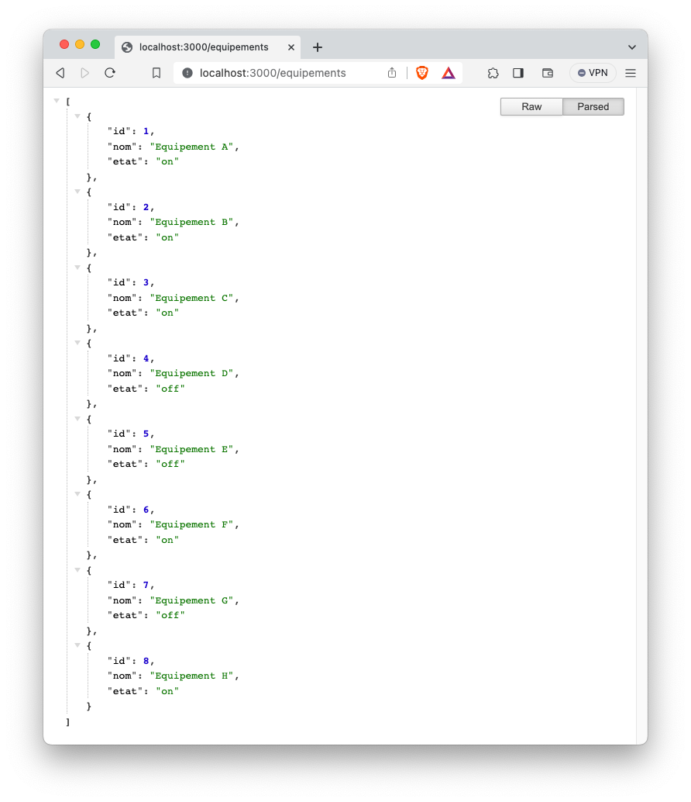

### Create Node.js App
First, we create a folder:

```shell
$ mkdir nodejs-express
$ cd nodejs-express
```

Next, we initialize the Node.js App with a package.json file:

```
npm init

name: (nodejs-express)
version: (1.0.0)
description: Node.js Restful CRUD API with Node.js, Express
entry point: (index.js) server.js
test command:
git repository:
keywords: nodejs, express, rest, api
author: Raouf25
license: (ISC)

Is this ok? (yes) yes
```

We need to install necessary modules: express.
Run the command:
```
npm install express --save
```
The package.json file should look like this:
```json
{
  "name": "nodejs-express",
  "version": "1.0.0",
  "description": "Node.js Restful CRUD API with Node.js, Express",
  "main": "server.js",
  "scripts": {
    "test": "echo \"Error: no test specified\" && exit 1"
  },
  "keywords": [
    "nodejs",
    "express",
    "rest",
    "api"
  ],
  "author": "Raouf25",
  "license": "ISC"
}
```
### Setup Express web server
In the root folder, let’s create a new server.js file:
```js
// server.js
const express = require('express');
 
const app = express();
const port = 3000;


const equipements = [
  { id: 1, nom: 'Equipement A', etat: 'on' },
  { id: 2, nom: 'Equipement B', etat: 'off' },
  { id: 3, nom: 'Equipement C', etat: 'on' },
  { id: 4, nom: 'Equipement D', etat: 'off' },
  { id: 5, nom: 'Equipement E', etat: 'on' },
  { id: 6, nom: 'Equipement F', etat: 'off' },
  { id: 7, nom: 'Equipement G', etat: 'on' },
  { id: 8, nom: 'Equipement H', etat: 'off' }
];

// Route pour obtenir la liste des équipements
app.get('/equipements', (req, res) => {
  res.json(equipements);
});

// Route pour obtenir un équipement par son ID
app.get('/equipements/:id', (req, res) => {
  const id = parseInt(req.params.id);
  const equipement = equipements.find((e) => e.id === id);

  if (equipement) {
    res.json(equipement);
  } else {
    res.status(404).send('Equipement not found');
  }
});

// Route pour ajouter un nouvel équipement
app.post('/equipements', (req, res) => {
  const newEquipement = req.body;
  equipements.push(newEquipement);
  res.status(201).json(newEquipement);
});


app.use(express.json()) // parse json body content

app.put('/equipements/:id', (req, res) => {
  const id = Number(req.params.id)
  const index = equipements.findIndex(equipement => equipement.id === id)
  if (index === -1) {
      return res.status(404).send('equipement not found')
  }
  const updatedEquipement = {
      id: equipements[index].id,
      nom: req.body.nom || equipements[index].nom, // Utiliser req.body.nom s'il existe, sinon utiliser equipements[index].nom
      etat: req.body.etat
  }
  equipements[index] = updatedEquipement
  res.status(200).json(equipements[index])
})


// Route pour supprimer un équipement par son ID
app.delete('/equipements/:id', (req, res) => {
  const id = parseInt(req.params.id);
  const equipementIndex = equipements.findIndex((e) => e.id === id);

  if (equipementIndex !== -1) {
    equipements.splice(equipementIndex, 1);
    res.send('Equipement deleted');
  } else {
    res.status(404).send('Equipement not found');
  }
});


app.listen(port, () => {
  console.log(`Server is running at http://localhost:${port}`);
});
```
Now let’s run the app with command: 
```shell
node server.js
```
Open your browser with url ``http://localhost:3000/equipements``, you will see:



## How test Rest API 
```shell
#!/bin/bash

check_command() {
  command -v "$1" >/dev/null 2>&1 || {
    echo >&2 "I require $1 but it's not installed."
    echo >&2 "Installation : $2"
    echo >&2 "Aborting."
    exit 1
  }
}

check_command "curl" "https://everything.curl.dev/get"
check_command "jq" "https://stedolan.github.io/jq/"


api_url="http://localhost:3000/equipements"

# Envoyer la requête HTTP et stocker la réponse JSON dans un fichier temporaire
curl -s $api_url > equipements.json
cat equipements.json

 jq -r '.[].id' equipements.json | sort | uniq > equipements_ids.json
 jq -r '.[].etat' equipements.json | sort | uniq > equipements_etats.json

# Nombre de secondes à exécuter le code (3 minutes = 180 secondes)
total_seconds=180

while [ $total_seconds -gt 0 ]; do
  # Obtenir une valeur aléatoire d'identifiant (random_id)
  random_id=$(shuf -n 1 equipements_ids.json)

  # Obtenir une valeur aléatoire d'état (random_etat)
  random_etat=$(shuf -n 1 equipements_etats.json)

  echo -e "\nRandom ID: $random_id" " Random Etat: $random_etat"

  curl -s --location --request PUT "$api_url/$random_id" \
  --header "Content-Type: application/json" \
  --data "{
      \"etat\": \"$random_etat\"
  }"

  # Attendre une seconde avant la prochaine exécution
  sleep 1

  # Décrémenter le compteur de secondes
  total_seconds=$((total_seconds - 1))
done

# Supprimer les fichiers temporaires
rm  equipements.json equipements_ids.json equipements_etats.json
```
This Bash script:
- checks for the availability of necessary commands (curl and jq), 
- retrieves data from an API, extracts and processes the data, 
- repeatedly sends PUT requests to the API with random data for a specified duration. It uses random equipment identifiers and states and waits for one second between each request. 

NB: Temporary files are created and removed during the process.

Run this script: 
``` shell

/bin/bash ./equipment_script.sh 
```
Output looks like: 
```
[{"id":1,"nom":"Equipement A","etat":"on"},{"id":2,"nom":"Equipement B","etat":"on"},{"id":3,"nom":"Equipement C","etat":"on"},{"id":4,"nom":"Equipement D","etat":"off"},{"id":5,"nom":"Equipement E","etat":"off"},{"id":6,"nom":"Equipement F","etat":"on"},{"id":7,"nom":"Equipement G","etat":"off"},{"id":8,"nom":"Equipement H","etat":"on"}]
Random ID: 3  Random Etat: off
{"id":3,"nom":"Equipement C","etat":"off"}
Random ID: 1  Random Etat: off
{"id":1,"nom":"Equipement A","etat":"off"}
Random ID: 2  Random Etat: off
{"id":2,"nom":"Equipement B","etat":"off"}
Random ID: 7  Random Etat: on
{"id":7,"nom":"Equipement G","etat":"on"}
Random ID: 5  Random Etat: off
...
```


